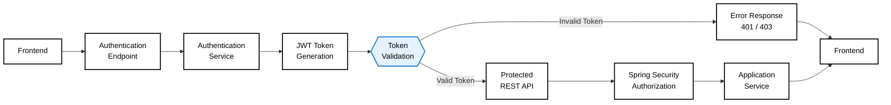

# Customer Support Backend : Wavepoint 
---

## Overview

**Wavepoint Support Backend** is a production-ready Spring Boot REST API providing the foundation for the Wavepoint Customer Support Portal. Built with enterprise-grade architecture principles, it handles authentication, customer support requests, feedback management, product updates, and transactional email delivery through Gmail API integration.

### Core Services

- **Authentication & Authorization** : JWT-based authentication with Spring Security
- **Email Notifications** : Gmail API integration for transactional emails
- **Support Request Management** : Customer grievance tracking and resolution
- **Feedback & Ideas** : Customer feedback and product suggestion collection
- **Product Updates** : Feature releases, maintenance notices, and announcements
- **Admin Operations** : Administrative controls and system management
- **Support Assistance** : AI-powered support bot integration (WaveBot)
- **Persistent Data Management** : Spring Data JPA with MySQL backend
- **Health Monitoring** : Application health checks and status endpoints

---

## Architecture

The backend implements a **layered, modular monolith architecture** that separates concerns across controllers, services, repositories, and entities while maintaining clear boundaries for potential future service extraction.

### Security & Authentication Flow



### Technology Stack

| Component | Technology |
|-----------|-----------|
| **Framework** | Spring Boot 4.1.0 |
| **Language** | Java 26 |
| **Build System** | Gradle |
| **Web Framework** | Spring Web (REST) |
| **Security** | Spring Security + JWT |
| **Persistence** | Spring Data JPA / Hibernate |
| **Database** | MySQL on AWS RDS |
| **Email Service** | Gmail API (OAuth 2.0) |
| **Deployment** | Render (Docker) |
| **Frontend Integration** | Vercel (React + Vite) |

---

## Project Structure

```
CustSupportBackend/
│
├── src/main/java/com/wavepoint/
│   │
│   ├── config/                   # Configuration classes
│   │   ├── SecurityConfig.java   # Spring Security & JWT configuration
│   │   ├── GmailConfig.java      # Gmail API OAuth 2.0 setup
│   │   └── CorsConfig.java       # CORS policy configuration
│   │
│   ├── controller/               # REST API Controllers
│   │   ├── AuthController.java
│   │   ├── SupportController.java
│   │   ├── FeedbackController.java
│   │   ├── RequestController.java
│   │   ├── UpdateController.java
│   │   ├── AdminController.java
│   │   └── HealthController.java
│   │
│   ├── service/                  # Business Logic Services
│   │   ├── AuthService.java
│   │   ├── SupportService.java
│   │   ├── FeedbackService.java
│   │   ├── RequestService.java
│   │   ├── UpdateService.java
│   │   ├── AdminService.java
│   │   ├── MailService.java      # Email delivery
│   │   └── HealthService.java
│   │
│   ├── repository/               # Data Access Layer
│   │   ├── UserRepository.java
│   │   ├── SupportRepository.java
│   │   ├── FeedbackRepository.java
│   │   ├── RequestRepository.java
│   │   ├── UpdateRepository.java
│   │   └── AdminRepository.java
│   │
│   ├── entity/                   # JPA Entities
│   │   ├── User.java
│   │   ├── SupportRequest.java
│   │   ├── Feedback.java
│   │   ├── Request.java
│   │   └── Update.java
│   │
│   ├── dto/                      # Data Transfer Objects
│   │   ├── LoginRequest.java
│   │   ├── AuthResponse.java
│   │   ├── SupportRequestDTO.java
│   │   ├── FeedbackDTO.java
│   │   └── UpdateDTO.java
│   │
│   ├── security/                 # Security components
│   │   ├── JwtProvider.java      # JWT token generation & validation
│   │   ├── CustomUserDetails.java
│   │   └── JwtAuthFilter.java    # JWT request filter
│   │
│   ├── exception/                # Custom exception handling
│   │   ├── AuthenticationException.java
│   │   ├── ResourceNotFoundException.java
│   │   └── GlobalExceptionHandler.java
│   │
│   └── WavePointSupportApplication.java  # Spring Boot entry point
│
├── src/main/resources/
│   ├── application.properties    # Configuration properties
│   ├── application-dev.properties
│   └── application-prod.properties
│
├── src/test/java/                # Unit & Integration Tests
│
├── build.gradle                  # Gradle build configuration
├── Dockerfile                    # Docker containerization
├── .gitignore
└── README.md
```

---

## Getting Started

### Prerequisites

- Java 26 or higher
- Gradle build system
- MySQL database (local or AWS RDS)
- Google Cloud Project with Gmail API enabled
- Environment variables configured

### Installation

1. **Clone the repository**
   ```bash
   git clone https://github.com/Y-K-SAI-SRIKAR/CustSupportBackend.git
   cd CustSupportBackend
   ```

2. **Build the application**
   ```bash
   ./gradlew clean build
   ```

3. **Run the application**
   ```bash
   ./gradlew bootRun
   ```

   Or run the JAR directly:
   ```bash
   java -jar build/libs/wavepoint-support-backend-*.jar
   ```

The API will be available at:
```
http://localhost:8080
```

### Health Check

Verify the application is running:
```bash
curl http://localhost:8080/api/health
```


---

## Security

### Authentication

The backend uses **JWT (JSON Web Tokens)** for stateless authentication:

1. Client sends credentials to `/api/auth/login`
2. Server validates and generates a JWT token
3. Client includes token in `Authorization: Bearer <token>` header
4. Server validates token via `JwtAuthFilter`
5. Request is processed with authenticated user context

### Password Security

- Passwords are hashed using **bcrypt**
- Never stored in plaintext
- Password reset emails contain secure, time-limited tokens

### CORS Configuration

CORS is restricted to known frontend origins:

```properties
cors.allowed-origins=http://frontend.com
```
---

## Email Service

The backend uses **Gmail API** for transactional email delivery.

### Configuration

Gmail is configured with OAuth 2.0 (not SMTP):

```java
// src/main/java/com/wavepoint/config/GmailConfig.java
@Configuration
public class GmailConfig {
    public Gmail gmailService() {
        // Initialize Gmail client with OAuth credentials
    }
}
```

### Supported Email Types

- **Authentication Emails** : Welcome, login verification, password reset
- **Support Acknowledgements** : Support request confirmations
- **Feedback Confirmations** : Feedback submission acknowledgements
- **Update Notifications** : Product update announcements
- **Suggestion Acknowledgements** : Feature request confirmations

### Permissions

The application requests only the minimum required Gmail permission:

```
https://www.googleapis.com/auth/gmail.send
```

---

## Database

### Schema Overview

**Users Table**
- `id` (Primary Key)
- `email` (Unique)
- `password_hash`
- `role` (USER / ADMIN)
- `created_at`

**Support Requests Table**
- `id` (Primary Key)
- `user_id` (Foreign Key)
- `title`
- `description`
- `status` (OPEN / IN_PROGRESS / RESOLVED)
- `priority`
- `created_at`
- `updated_at`

**Feedback Table**
- `id` (Primary Key)
- `user_id` (Foreign Key)
- `feedback_type`
- `message`
- `rating`
- `created_at`

**Updates Table**
- `id` (Primary Key)
- `title`
- `description`
- `category` (FEATURE_RELEASE / MAINTENANCE / ANNOUNCEMENT)
- `published_at`
---

## Deployment

### Production (Render)

The backend is deployed on **Render** with:

- **Automatic builds** from GitHub repository
- **Environment variables** stored securely in Render settings
- **PostgreSQL/MySQL** database on AWS RDS
- **HTTPS/SSL** enabled automatically

---

## Testing

### Run Tests

```bash
# Run all tests
./gradlew test

# Run specific test class
./gradlew test --tests AuthControllerTest

# Run with coverage
./gradlew test jacocoTestReport
```

### Test Structure

```
src/test/java/com/wavepoint/
├── controller/
│   ├── AuthControllerTest.java
│   └── SupportControllerTest.java
├── service/
│   ├── AuthServiceTest.java
│   └── SupportServiceTest.java
└── security/
    └── JwtProviderTest.java
```

---

## Development Workflow

1. **Create Feature Branch**
   ```bash
   git checkout -b feature/your-feature-name
   ```

2. **Make Changes**
   - Follow Spring Boot conventions
   - Implement separation of concerns (Controller → Service → Repository)
   - Add unit/integration tests

3. **Build & Test Locally**
   ```bash
   ./gradlew clean build
   ```

4. **Commit & Push**
   ```bash
   git add .
   git commit -m "feat: add new feature description"
   git push origin feature/your-feature-name
   ```

5. **Create Pull Request**
   - Describe changes clearly
   - Link related issues
   - Ensure CI/CD passes

6. **Deploy**
   - Merge to `main` branch
   - Render automatically deploys from GitHub

---

## Architecture Principles

### Separation of Concerns

```
Controller (HTTP concerns)
    ↓
Service (Business logic)
    ↓
Repository (Data access)
    ↓
Entity (Domain model)
```

### Layered Architecture

- **Presentation Layer** : REST Controllers
- **Business Logic Layer** : Services
- **Persistence Layer** : Repositories & JPA
- **Database Layer** : MySQL on AWS RDS
- **External Integration Layer** : Gmail API, OAuth

### Design Patterns

- **Service Layer Pattern** — Centralized business logic
- **Repository Pattern** — Data access abstraction
- **DTO Pattern** — API contracts separate from entities
- **Configuration Classes** — Centralized Spring configuration
- **Exception Handling** — Global exception handler
- **JWT Authentication** — Stateless security

---

## Monitoring & Observability

### Health Endpoint

**GET** `/api/health`

```json
{
  "status": "UP",
  "database": "UP",
  "components": {
    "diskSpace": {
      "status": "UP"
    },
    "mail": {
      "status": "UP"
    }
  }
}
```

### Application Logs

Spring Boot logs provide visibility into:

- Application startup and configuration
- HTTP request handling
- Database operations
- Authentication/authorization events
- Email dispatch
- Error and exception details

Configure log levels in `application.properties`:

```properties
logging.level.com.wavepoint=DEBUG
logging.level.org.springframework.security=DEBUG
logging.level.org.hibernate.SQL=DEBUG
```

---

## Security Best Practices

### Do's 

- Use environment variables for all secrets
- Validate all input at controller level
- Implement rate limiting
- Use HTTPS in production
- Keep dependencies updated
- Log security events
- Use strong JWT secrets
- Implement proper CORS

### Don'ts 

- Never commit credentials to Git
- Never use default passwords
- Don't expose stack traces in production
- Don't log sensitive data
- Don't use wildcard CORS in production
- Don't skip input validation
- Don't store passwords in plaintext

---

## Frontend Integration

### Frontend Repository

```
GitHub: https://github.com/Y-K-SAI-SRIKAR/WavePoint-Support
Production: https://wave-point-support.vercel.app
```

### Frontend Stack

- React 18 + Vite
- TypeScript
- TailwindCSS
---

## Troubleshooting

### Database Connection Issues

```bash
# Test database connection
# Check SPRING_DATASOURCE_URL environment variable
# Verify AWS RDS security groups allow inbound traffic
```

### JWT Token Errors

```
Error: "Invalid JWT token"
Solution: Ensure JWT_SECRET environment variable matches on all instances
```

### Gmail API Errors

```
Error: "Failed to send email"
Solution: Verify Google OAuth credentials and gmail.send permission is enabled
```

### Port Already in Use

```bash
# Default port: 8080
# Change port in application.properties:
server.port=8081
```
---
## License

This project is licensed under the MIT License. see the [LICENSE](LICENSE) file for details.

-----

**Maintained by:** YERRAGUNTLA KAMESWARA SAI SRIKAR
**Last Updated:** September 13, 2026.